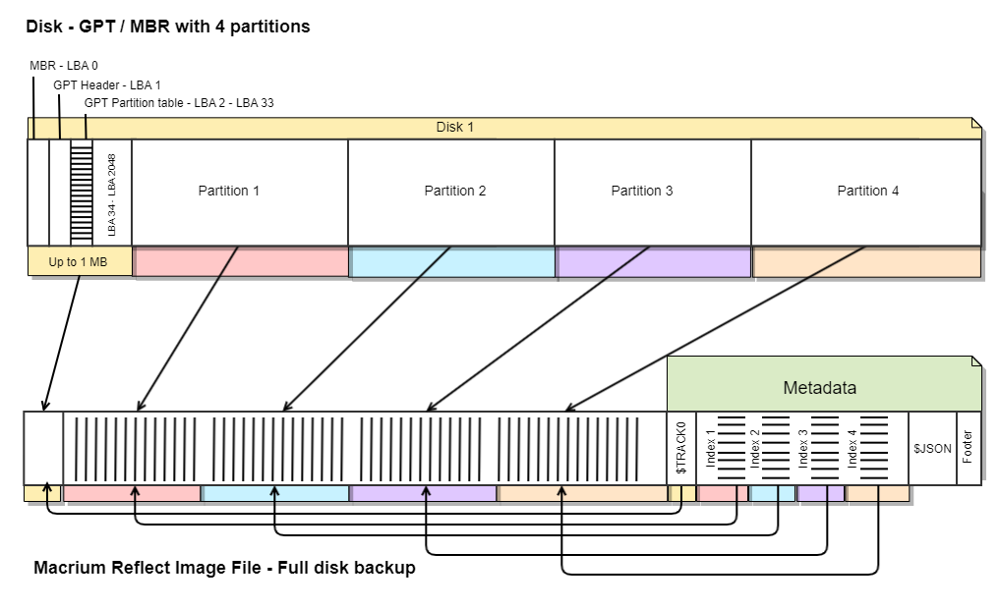
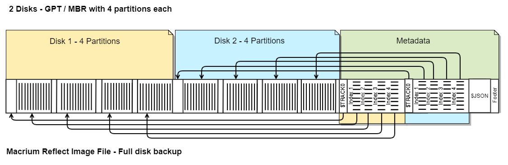
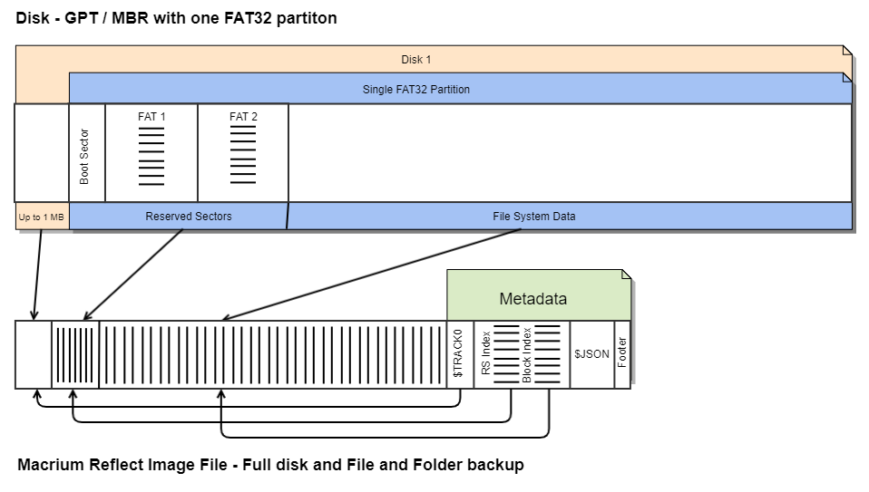
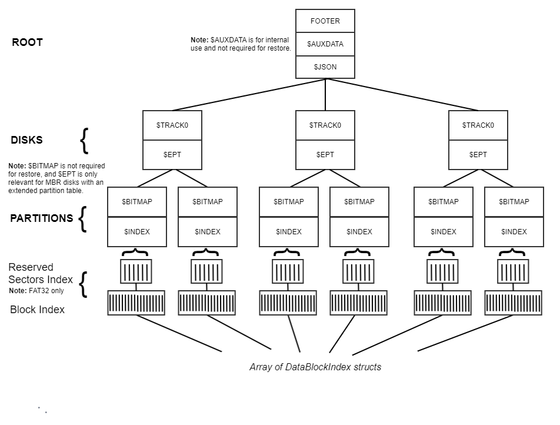

 <br>Experience data independence with love, from us to you. 


***

## Macrium Reflect X Image File layout

> [!NOTE]
> This layout is not valid for Image Files created with Macrium Reflect v8.x or earlier.
***
## Overview
The data layout in an image file is similar to that on a physical disk, including disk format, partitions, and file systems. The following digram shows how a single disk directly maps to a full disk image. 




The following diagram shows how multiple disks map to a full disk image. The disks are arranged in sequence, with the metadata for all disks located at the end of the file.



Incremental image files contain only data blocks that are different from the prevous image in the backup set. Differential image files contain only data blocks that are different from the full image in the backup set.
> [!NOTE]
> Consolidated images may contain data blocks out of sequence and optimized for storage efficiency. All consolidated data bolcks are positioned prior to the metadata at the end of the file.
<hr>

## Special considerations for FAT File Systems
FAT file systems, including FAT32/16/12, are managed differently within image files because of Reserved Sectors preceding the file system data. These reserved sectors comprise the Boot Sector, followed by up to 2 copies of the File Allocation Table (FAT).

In instances where non-standard FAT32 file systems exceed the Windows maximum of 32GB, the number of reserved sectors can be substantial. To address this, the reserved sectors data is segmented into 4MB blocks and indexed in the `Reserved Sectors Index`, which is positioned before the primary block index in the metadata. A `Reserved Sectors Index`exists for every FAT file system backed up. 

> [!NOTE]
> As with file system Data blocks, Reserved sector blocks may be compressed and/or encrypted depending on the backup settings.



> [!NOTE]
> The example above also describes the exact image file format for all Macrium `File and Folder backups`.

***
## Let's dive deeper by looking at the metadata elements that make up the image file:


***
## File Footer

At the end of each image file, a 20-byte sequence verifies the file as a Macrium Image through a 12-byte magic identifier and provides the offset to the initial Metadata block to enable the continued reading of the file. 

```c++
struct FileFooter
{
    uint64_t firstmetadatablockheader;
    uint8_t magicbytes[12]; // MACRIUM_FILE
};
```
***
## Metadata Block

Metadata blocks are structured to store binary data. Blocks are organized lists, and each block is preceded by a header, which provides the data's length, its encryption and compression statuses, the MD5 hash of the data, and whether this is the last block in the list.

```c++
struct HeaderFlags
{
    unsigned char LastBlock : 1;   
    unsigned char Compression : 1; 
    unsigned char Encryption : 1;  
    unsigned char Unused : 5;
};

struct MetadataBlockHeader
{
    char  BlockName[8];   
    unsigned long BlockLength; 
    unsigned char  Hash[16]; 
    HeaderFlags Flags;
    char Padding[3];
};
```
BlockName may be set to the following values.
```c++
// JSON data that describes the image file and supplementary backup information. 
char* const JSON_HEADER   = "$JSON   ";

// disk data
char* const TRACK_0       = "$TRACK0 ";
char* const EXT_PAR_TABLE = "$EPT    ";

// partition data
char* const BITMAP_HEADER = "$BITMAP ";
```
Not all BlockName headers are included in this document.  <br><br>
**Reading the block list**  <br>
`If LastBlock == 0, then the next block begins at the file offset for this block + sizeof(MetadataBlockHeader) + blocklength`

***

## Data Block Index Element

Block index elements specify both the position and the size of a Data Block within the file, where Data Blocks contain the actual data from the imaged file system. These elements are organized in a vector list, and represent the full extent of the imaged file system. This layout enables easy location and retrieval of the stored data.

```c++
struct DataBlockIndexElement
{
    uint64_t fileposition;
    uint8_t hash[16];
    uint32_t blocklength;
    uint32_t filenumber;
}
```
***
## Data Block
A Data Block is the raw data of the imaged file system. Each block is a fixed length per partition, and can be compressed and/or encrypted based on the backup settings. The location and size of each block are shown in a related Data Block Index Element.<br>

```c++
uint8_t blockdata[blocklength];
```
| Information  | Link |
| :------------- | :------------- |
Encryption Implementation | [See here](ENCRYPTION.md)

***
### ROOT - $JSON
This mandatory metadata block, at the root level of the file, is the source of navigational and supplementary information necessary for understanding and accessing the contents of the backup. This JSON text also provides auxiliary data including details about the backup environment and settings. 

| Information  | Link |
| :------------- | :------------- |
JSON Schema details | [See here](../schema)  <br>
Example Image file JSON | [See here](../schema/examples/image_1.json) <br>
Example File and Folder backup JSON | [See here](../schema/examples/file_and_folder_1.json) <br>
***
### DISK - $TRACK0

This mandatory metadata block contains the initial sectors on the disk up to the 1st partition, with a maximum size of 1,048,576 bytes (1MB). This includes the critical boot and partition data structures. For Master Boot Record (MBR) disks, it includes the MBR itself along with the partition table. For GUID Partition Table (GPT) disks, it provides the GPT header and partition table. Beyond the MBR, the extra data for MBR disks may include additional disk boot code, such as Linux's GRUB bootloader.

MBR formatted disks at LBA 0 (Sector 1):
```c++
struct Partition {
    uint8_t  status;
    uint8_t  startHead;
    uint16_t startSectorCylinder;
    uint8_t  type;
    uint8_t  endHead;
    uint16_t endSectorCylinder;
    uint32_t bootSectorOffset;  
    uint32_t numberOfSectors;
} ;

struct BootRecord {
    uint8_t  bootCode[442];
    uint32_t signature;
    Partition partitionEntries[4];
    uint16_t idCode;
};

```
GPT formatted disks, starting at offset LBA 1 (Sector 2) in $TRACK0:
```c++
struct gptheader {
    uint64_t signature;
    uint32_t revision;
    uint32_t header_size;
    uint32_t header_crc32;
    uint32_t reserved1;
    uint64_t my_lba;
    uint64_t alternate_lba;
    uint64_t first_usable_lba;
    uint64_t last_usable_lba;
    efi_guid_t disk_guid;
    uint64_t partition_entry_lba;
    uint32_t num_partition_entries;
    uint32_t sizeof_partition_entry;
    uint32_t partition_entry_array_crc32;
    uint8_t  reserved2[420];
};
```
The GPT partition table is typically at LBA 2 (sector 3), but can be found by reading the partition_entry_lba field in the gptheader struct. 
```c++
struct gpt_entry_attributes
{
    uint64_t required_to_function:1;
    uint64_t reserved:47;
    uint64_t type_guid_specific:16;
};

struct gpt_table_entry {
    efi_guid_t partition_type_guid;
    efi_guid_t unique_partition_guid;
    uint64_t starting_lba;
    uint64_t ending_lba;
    gpt_entry_attributes attributes;
    uint16_t partition_name[36];
};

```
A Windows GPT formatted disk contains an array of 128 gpt_table_entry structures. 

Note: $TRACK0 may be the only metadata block at disk level.
***
### DISK - $EPT
This optional metadata block contains an array of Extended Partition Tables (Extended Boot Records), preceded by a uint32_t count of elements. 
> [!NOTE]
> $EPT data is only populated for MBR formatted disks with an extended partition table.

```c++
struct Partition {
    uint8_t  status;
    uint8_t  startHead;
    uint16_t startSectorCylinder;
    uint8_t  type;
    uint8_t  endHead;
    uint16_t endSectorCylinder;
    uint32_t bootSectorOffset;  
    uint32_t numberOfSectors;
} Partition;

struct BootRecord {
    uint8_t  bootCode[442];
    uint32_t signature;
    Partition partitionEntries[4];
    uint16_t idCode;
} BootRecord;

struct ExtendedPartitionTable
{
    PartitionSector partitionsector;
    uint64_t  diskbyteoffset;
    uint16_t  partitionnumber;
};
```
***
### PARTITION - $BITMAP
This optional metadata block contains the $BITMAP metadata related to the file system. Currently, it is only populated for exFAT and ReFS file systems. Although it provides valuable insights into the file system structure, this block is not mandatory for the restoration of the image file.
***

